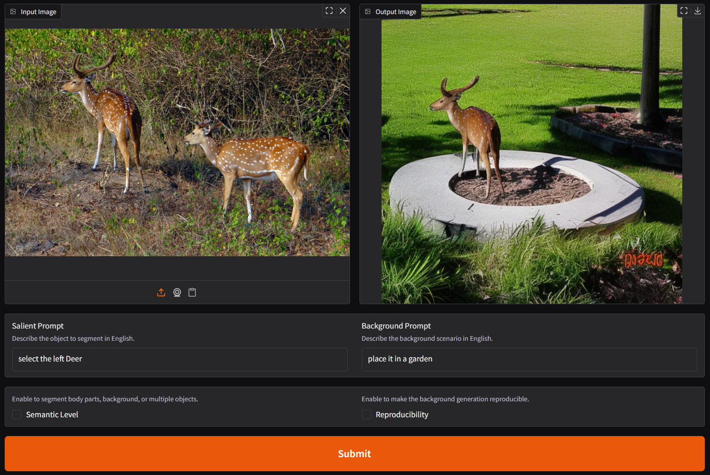

# SalientX

Based on the prompt change background of image but the position of salient remain unchanged.

<p>
</a>
</p>

## Concepts

- Inputs: Image, salient and background prompt
- Resize Image to (512, 512) but maintaining the ratio
- Send the resize image to `SAM` based model
- Send the prompt image and result of `SAM` based model to `Stable Diffusion` + `ControlNet` model


## Acknowledgement

### ⚠️ Note on EVF-SAM Usage

We have borrowed some code from the official [EVF-SAM](https://github.com/hustvl/EVF-SAM) repository. Initially, our team intended to integrate EVF-SAM directly via the Hugging Face `transformers` library using:

```python
AutoModel.from_pretrained("...")
```

However, as of now, EVF-SAM does not support loading through `AutoModel.from_pretrained`. For reference, you can check the related Hugging Face model page: [EVF-SAM-MULTITASK](https://huggingface.co/YxZhang/evf-sam2-multitask).

## Citations

This project leverages the EVF-SAM model proposed by EVF-SAM team. If you find this work useful, please consider citing the original paper

```
@article{zhang2024evfsamearlyvisionlanguagefusion,
      title={EVF-SAM: Early Vision-Language Fusion for Text-Prompted Segment Anything Model}, 
      author={Yuxuan Zhang and Tianheng Cheng and Rui Hu and Lei Liu and Heng Liu and Longjin Ran and Xiaoxin Chen and Wenyu Liu and Xinggang Wang},
      year={2024},
      eprint={2406.20076},
      archivePrefix={arXiv},
      primaryClass={cs.CV},
      url={https://arxiv.org/abs/2406.20076}, 
}
```

Salient Object-Aware Background Generation

```
@misc{eshratifar2024salient,
      title={Salient Object-Aware Background Generation using Text-Guided Diffusion Models}, 
      author={Amir Erfan Eshratifar and Joao V. B. Soares and Kapil Thadani and Shaunak Mishra and Mikhail Kuznetsov and Yueh-Ning Ku and Paloma de Juan},
      year={2024},
      eprint={2404.10157},
      archivePrefix={arXiv},
      primaryClass={cs.CV}
}
```
